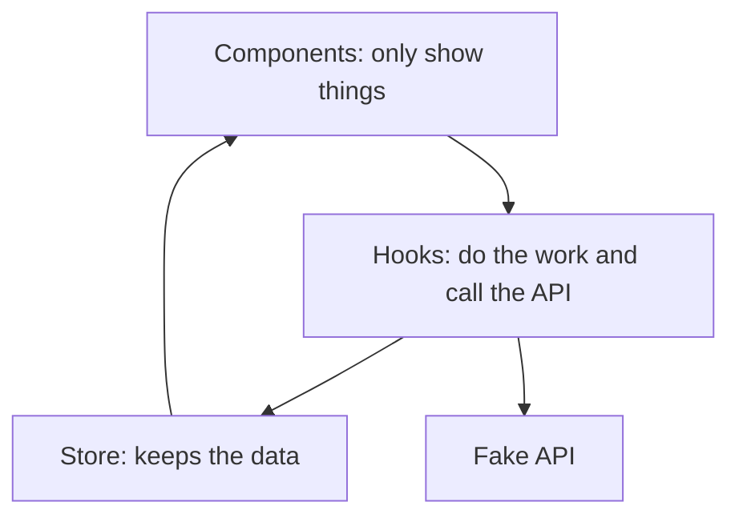
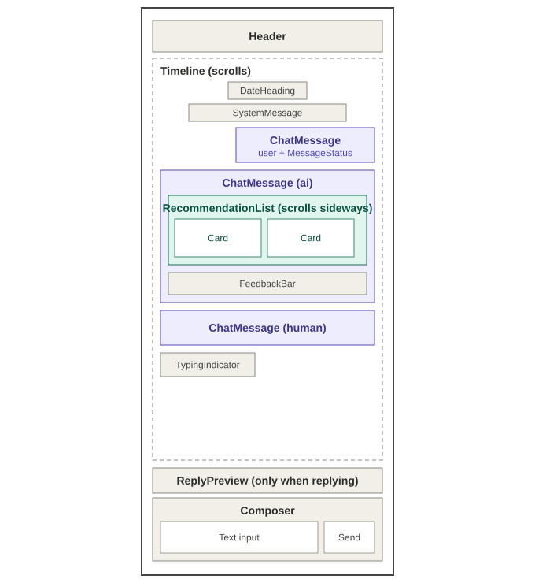
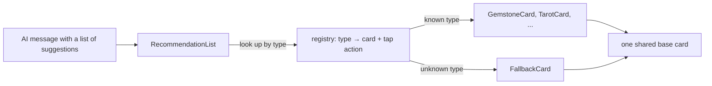
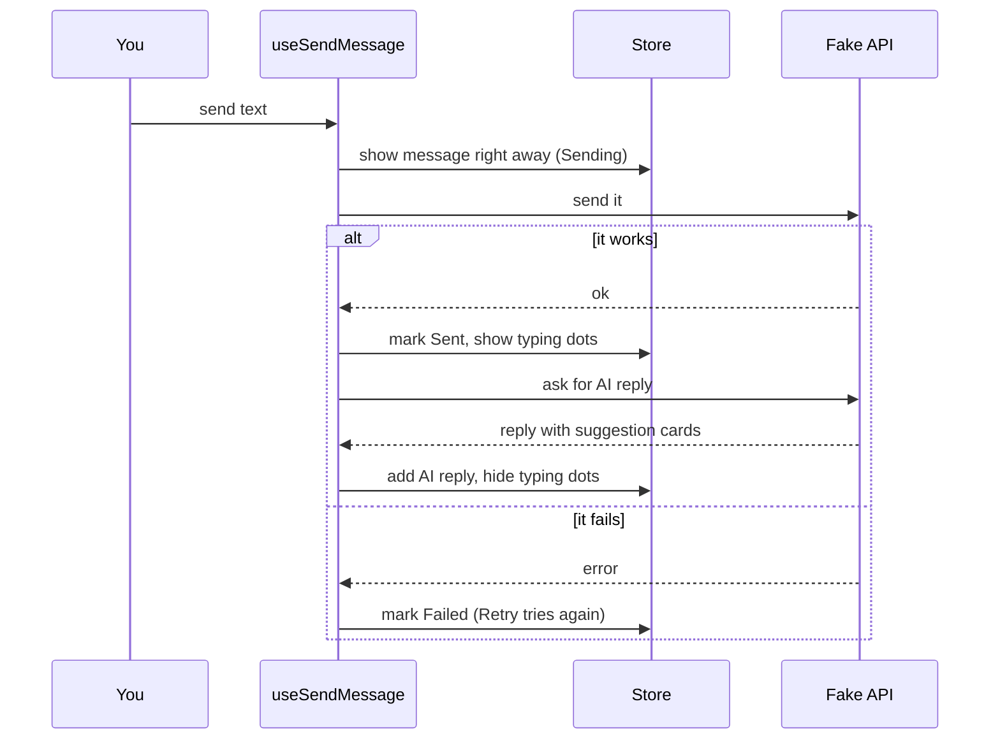

# MyNaksh AI Conversation Experience

A chat app where the AI's replies can also show small **suggestion cards** (gemstone, tarot, consultation, article, offer). New card types can be added easily later. The backend is fake (mocked).

**Built with:** React Native CLI, TypeScript, React Navigation, Reanimated (animations), Zustand (state)

## How to run
```
npm install --legacy-peer-deps
npm start             # starts the dev server on port 8082
npm run android       # builds and installs the app on an emulator or phone
```
Metro uses port 8082 (set in `package.json`); change it there if it clashes with another service.

To try the different states, open `src/api/conversationApi.ts`:
- `failLoad: true` shows the "Unable to load" error screen.
- `sendFailRate` decides how often sending fails (default 30%).
- Delete all messages to see the empty screen.

## What is built (and where)
| Requirement | Where to look |
|---|---|
| Chat list, auto-scroll, date headings, grouping | `features/conversation/Timeline`, `utils/groupMessages` |
| User, AI, astrologer and system messages | `features/conversation/messageRegistry` |
| Suggestion cards, sideways scroll, Alert on tap | `features/recommendations/*` |
| Long-press: Reply, Copy, Delete | `hooks/useMessageActions` |
| Reply preview above the input box | `features/conversation/ReplyPreview` |
| Like / Dislike and reason chips | `features/conversation/FeedbackBar` |
| Sending: Sending, Sent, Failed, Retry | `hooks/useSendMessage` |
| Loading, empty and error screens | `components/StateView`, `screens/ConversationScreen` |

## Folder guide
```
src/
  api/         fake API (load chat, send message, get AI reply)
  data/        the starting conversation
  types/       shapes of data (Message, Recommendation, ...)
  store/       Zustand store: holds the app data
  hooks/       the logic: calls the API and updates the store
  utils/       small helpers (dates, grouping messages)
  components/  small reusable pieces (StateView, Chip)
  features/
    recommendations/   suggestion cards
    conversation/      chat list, message bubbles, input box, feedback
  screens/  navigation/  theme.ts
```

## How it fits together

### Three layers

Components only display things. They never call the API directly. To use a real backend later, we only change the `api` folder and the hooks.

### Component layout diagram
The header, reply preview and input box stay fixed. Only the dashed Timeline area scrolls.



User, AI and astrologer messages all use **one** `ChatMessage` component. Only small settings differ (side, colour, label), so we don't copy code three times.

### How suggestion cards are shown (the main idea)

- The list does not know about any specific card type. It just asks the registry.
- Every card is a tiny wrapper around one shared base card.
- If the backend sends a type the app doesn't know, a plain default card is shown, so the app does not crash.
- **To add a new type** (for example `panchang`): add the name to `RecommendationType`, add a 3-line card in `cards/index.tsx`, add one line in `registry.ts`. Nothing else changes.
- Message types (user, AI, ...) work the same way.

### What happens when you send a message


## How data is kept (state)
One Zustand store keeps: the messages, the loading status, which message you are replying to, whether the AI is typing, and the like/dislike choices. It only stores data. The hooks call the API and then put the result in the store.
- Each component reads only the piece it needs, so the whole list does not redraw for small changes.
- Likes/dislikes are stored separately from messages, so reacting does not touch the message list.
- A reply keeps a copy of the quoted text, so deleting the original does not break it.
- Deleting does not jump the scroll: the list only auto-scrolls when a message is **added**, and it keeps its position otherwise.

## Animations
Typing dots while the AI "thinks", new messages slide in, suggestion cards appear one by one, and dislike chips expand. Only brand-new messages animate, so old messages don't replay the animation when you scroll back.

## Performance
- The chat uses `FlatList`, which only draws what is on screen.
- Message rows and cards are memoized, so they redraw only when their own data changes.
- Grouping messages is calculated only when the message list changes.
- Card lists are also virtualized.

## Extras (not asked in the brief)
Added to make the demo feel real. All are easy to remove:
- a fake AI reply after you send, with a typing indicator
- animations
- a MyNaksh-style light theme (colours taken from the official site: `#ede5da`, `#fbfaf8`, `#161a24`, brand `#803003`)
- the hooks layer

## Trade-offs (what I chose and why)
| Choice | Why | What we give up / alternative |
|---|---|---|
| Fake API, no saving | The brief says mocks are enough | Data resets when the app reloads |
| `FlatList` instead of FlashList | Built in, simple, and keeps scroll position reliably | FlashList is faster for very long chats |
| `Alert` for the long-press menu and card taps | Quickest, and the brief allows it | A bottom sheet looks nicer and allows more than 3 buttons on Android |
| Registries instead of big `if/switch` blocks | Adding a type means touching one place; unknown types don't crash | A little extra indirection |
| One `ChatMessage` with small settings | Less repeated code | Split it if the bubbles start to look very different |
| **API calls in hooks, not in the store** | The store stays simple and easy to test; the API can be swapped in one place | The flow is spread over api, hook and store |
| Hand-written hooks instead of **TanStack Query** | The fake API is tiny, time was limited, and the send/retry logic is easy to explain | TanStack Query would be an equally good, maybe even better, choice: it handles loading and errors, optimistic sending with rollback, caching and pagination. With a real backend I would use it for server data and keep Zustand only for screen state |
| Zustand instead of Redux Toolkit | Much less setup for this size | Redux Toolkit suits bigger teams or needs like middleware |
| AI reply is canned and ignores what you type | Shows the full flow end to end | A real backend would answer based on your text |
| No typewriter effect | The bubble growing while typing fights auto-scroll and the list | The reply fades in all at once |
| Simple theme, no custom fonts | Custom fonts need a native rebuild | The real site uses a serif heading font |
| No automated tests | Time | First ones to add: `groupMessages`, the store, `useSendMessage` |
| Tapping a reply quote doesn't jump to the original | Time | Scroll to the original message on tap |
